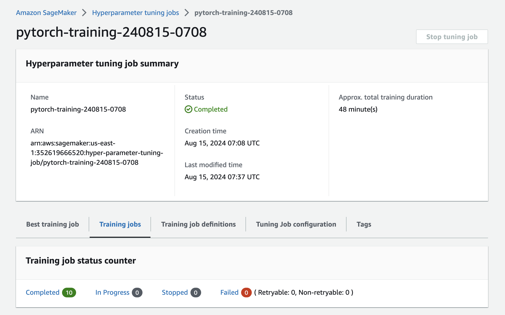
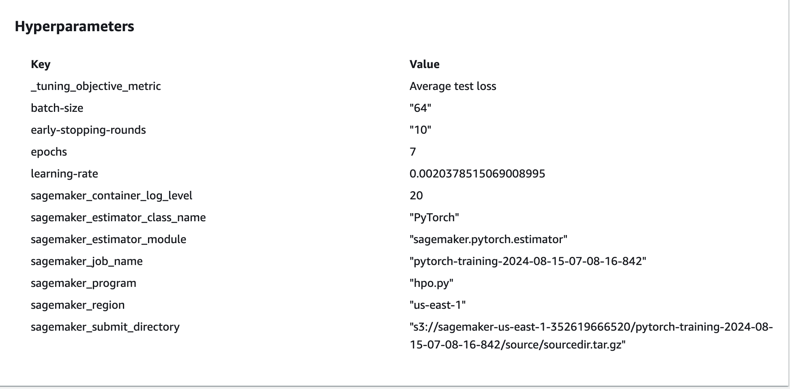

# Image Classification using AWS SageMaker

Use AWS Sagemaker to train a pretrained model that can perform image classification by using the Sagemaker profiling, debugger, hyperparameter tuning and other good ML engineering practices. This can be done on either the provided dog breed classication data set or one of your choice.

## Project Set Up and Installation
Enter AWS through the gateway in the course and open SageMaker Studio. 
Download the starter files.
Download/Make the dataset available. 

Project Files:
- ```train_and_deploy.ipynb``` : A Jupyter notebook that uses SageMaker SDK to perform hyperparameters tuning, model training and model endpoint deployment.


- ```hpo.py```: A Python script dedicated to optimizing hyperparameters.


- ```train_model.py```: A Python script dedicated to training the model.


- ```inference.py```: A Python script used by the deployed endpoint.

## Dataset
The provided dataset is the dogbreed classification dataset which can be found in the classroom.
The project is designed to be dataset independent so if there is a dataset that is more interesting or relevant to your work, you are welcome to use it to complete the project.

### Access
Upload the data to an S3 bucket through the AWS Gateway so that SageMaker has access to the data. 

## Hyperparameter Tuning
What kind of model did you choose for this experiment and why? Give an overview of the types of parameters and their ranges used for the hyperparameter search

- Remember that your README should:
- Include a screenshot of completed training jobs
- Logs metrics during the training process
- Tune at least two hyperparameters
- Retrieve the best best hyperparameters from all your training jobs

I have used a pre-trained ResNet50 model and applied transfer learning to adapt it for our dog breed classification dataset.

This model was selected due to its prior training on the large-scale ImageNet dataset, enabling it to capture general image features. 

Hyperparameter tuning was conducted using the following parameters:

- ```learning-rate``` Learning rate optimized within a continuous range from 0.001 to 0.1.
- ```batch-size ``` Batch size was tested with categorical values of 16 and 64.
- ```epochs``` The number of training epochs was adjusted between 5 and 10.
- ```early-stopping-rounds``` Early stopping rounds were explored with discrete values of 10, 12, 15, 17, and 20.

#### Hyperparmeters tuning job:

#### 10 Training jobs have been performed:

#### Best training job of the 10 performed:

#### And its hyperparameters values:


 Values from the best training job have been used to train our actual model.

## Debugging and Profiling

I have performed the actual model training job with best hyperparameters from the hyperparameters tuning step
I directly debugged and profiled that job by defining rules, collection_configs, hook_config, and profiler_config, which we passed to the Sagemaker estimator


### Results
The profiler report is available in ```ProfilerReport/profiler-output/profiler-report.html```.

```
rules = [
    Rule.sagemaker(rule_configs.vanishing_gradient()),
    Rule.sagemaker(rule_configs.overfit()),
    Rule.sagemaker(rule_configs.overtraining()),
    Rule.sagemaker(rule_configs.poor_weight_initialization()),
    ProfilerRule.sagemaker(rule_configs.ProfilerReport()),
]

hook_config = DebuggerHookConfig(
    hook_parameters={
        "train.save_interval": "100",
        "eval.save_interval": "10"
    }
)

profiler_config = ProfilerConfig(
    system_monitor_interval_millis=500, 
    framework_profile_params=FrameworkProfile(num_steps=1)
)
```


We can observe that the load is on the GPU and not the CPU; this is because in the training script we always load the model and data to 'cuda' if available.

## Model Deployment
We deployed the trained model with a SageMaker endpoint for inference that accepts JPEG image bytes as input.
```
model = PyTorchModel(
    model_data=model_data,
    role=role,
    entry_point='inference.py',
    py_version='py36',
    framework_version='1.8'
)

predictor = model.deploy(
    initial_instance_count=1,
    instance_type="ml.t2.medium",
    serializer=DataSerializer("image/jpeg")
)
```


#### How to invoke the endpoint
```
#Retrieve image data
image_url = "https://www.dogster.com/wp-content/uploads/2024/03/Akita-Inu-puppy-outdoors_Kristina-Chizhmar_Shutterstock.jpg"
response = requests.get(image_url)
img_bytes = response.content

#Invoke the endpoint
response = predictor.predict(
    img_bytes,
    initial_args={"ContentType": "image/jpeg"}
)
```

## Standout Suggestions
**TODO (Optional):** This is where you can provide information about any standout suggestions that you have attempted.
